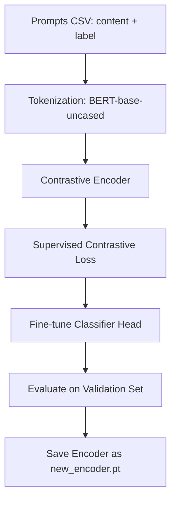
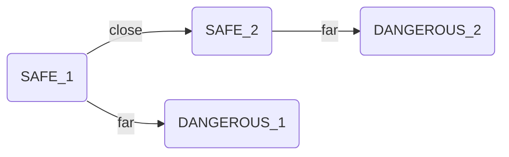
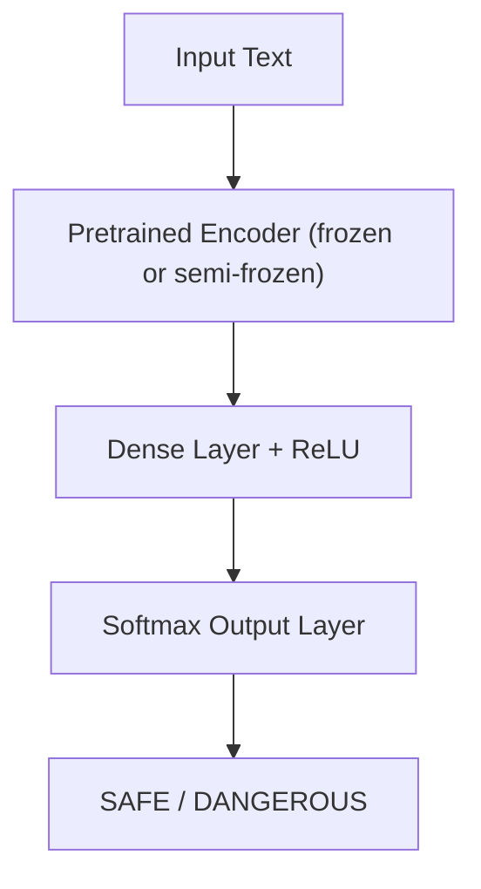
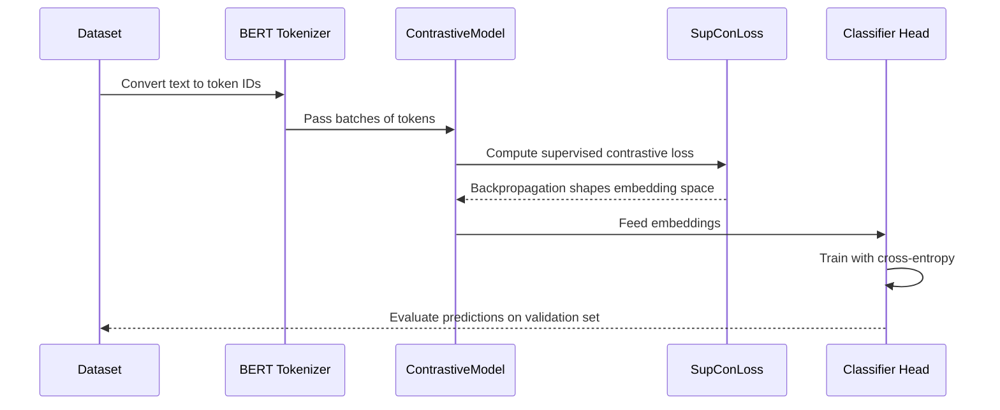

# 🧠 Supervised Contrastive Fine-Tuning for Prompt Safety Classification

This document provides a complete explanation of the **two-stage contrastive learning pipeline** used to classify prompts as **SAFE** or **DANGEROUS**.  
It combines representation learning through a **supervised contrastive loss** with a **fine-tuned classifier head**, resulting in a model that learns both semantic and safety-related structure in text data.

---

## 1. 🔍 Overview

The training process follows two stages:

1. **Stage 1 — Supervised Contrastive Pretraining**  
   Learn a semantic embedding space where similar prompts (e.g., SAFE–SAFE) are close together, and dissimilar ones (e.g., SAFE–DANGEROUS) are far apart.

2. **Stage 2 — Classification Fine-Tuning**  
   Train a classification head on top of the pretrained embeddings to predict SAFE vs DANGEROUS.

### Workflow Diagram



---

## 2. 📄 Data Preparation

The dataset (`prompts_rows.csv`) contains:

| Column | Description |
|--------|-------------|
| **content** | The raw text prompt |
| **label** | Either `SAFE` or `DANGEROUS` |

### Encoding and Tokenization

```python
df = pd.read_csv("prompts_rows.csv")
df['label_id'] = LabelEncoder().fit_transform(df['label'])  # SAFE=0, DANGEROUS=1
```

We use the `bert-base-uncased` tokenizer to tokenize the text, producing token IDs and attention masks for each prompt.

### Data Split

| Split | Purpose | Ratio |
|--------|----------|--------|
| Training | Learn embeddings and classifier | 80% |
| Validation | Evaluate generalization | 20% |

This split prevents overfitting and ensures robust evaluation.

---

## 3. 🧩 Stage 1 — Contrastive Representation Learning

### Objective

Train the encoder so that semantically similar prompts are close in embedding space, and different ones are far apart.  
This teaches the model to understand *safety semantics* without relying purely on label memorization.

### Intuitive Diagram



### Loss Function

The **Supervised Contrastive Loss** is defined as:

$$
\mathcal{L} = - \sum_{i \in I} \frac{1}{|P(i)|} \sum_{p \in P(i)} 
\log \frac{\exp(\text{sim}(z_i, z_p) / \tau)}{\sum_{a \in A(i)} \exp(\text{sim}(z_i, z_a) / \tau)}
$$

Where:
- \( z_i \): embedding of sample \( i \)
- \( P(i) \): set of positives (samples with same label)
- \( A(i) \): all other samples
- \( \tau \): temperature parameter controlling the contrast strength

### Intuition

- **Positive pairs** → embeddings are *pulled together*
- **Negative pairs** → embeddings are *pushed apart*

This helps the encoder develop structure in latent space before classification.

---

## 4. ⚙️ Stage 2 — Classifier Fine-Tuning

Once the encoder has learned general representations, we add a classifier head and fine-tune it using **cross-entropy loss**.

### Architecture



### Training Step

```python
logits = classifier(texts_batch)
loss = nn.CrossEntropyLoss()(logits, labels_batch)
```

This step focuses on precise label classification while preserving the embedding structure learned earlier.

---

## 5. 🧪 Evaluation and Metrics

The validation phase tests how well the model generalizes.

```python
acc = accuracy_score(all_labels, all_preds)
print(f"Validation Accuracy: {acc:.4f}")
```

| Metric | Description |
|---------|--------------|
| **Accuracy** | Proportion of correct predictions |
| **Loss Curve** | Indicates training stability |
| **Embedding Visualization** | Confirms whether SAFE/DANGEROUS clusters are separable |

### Optional: Visualize Embedding Space

Use t-SNE to confirm separation in latent space:

```python
from sklearn.manifold import TSNE
import matplotlib.pyplot as plt
import numpy as np

embeddings, labels = [], []
for batch in val_loader:
    texts_batch = batch['text']
    labels_batch = batch['labels']
    with torch.no_grad():
        emb = model(texts_batch)
    embeddings.append(emb.cpu().numpy())
    labels.append(labels_batch.cpu().numpy())

embeddings = np.concatenate(embeddings)
labels = np.concatenate(labels)
embeddings_2d = TSNE(n_components=2).fit_transform(embeddings)

plt.figure(figsize=(8,6))
plt.scatter(embeddings_2d[:,0], embeddings_2d[:,1], c=labels, cmap='coolwarm', alpha=0.6)
plt.title("t-SNE Projection of SAFE vs DANGEROUS Embeddings")
plt.xlabel("Dimension 1")
plt.ylabel("Dimension 2")
plt.show()
```

**Expected Output:**  
Two distinct clusters, one for SAFE and one for DANGEROUS.

---

## 6. 💾 Model Saving and Reuse

After training:

```python
torch.save(model.state_dict(), "new_encoder.pt")
```

This preserves the encoder for future tasks, including:
- Loading into **safety-filter APIs**
- Transfer learning to **new datasets**
- **Embedding visualization** and **interpretability analysis**

---

## 7. 🧠 Why This Architecture Makes Sense

| Design Element | Rationale |
|----------------|------------|
| **Contrastive pretraining** | Teaches the model general semantic structure beyond labels |
| **Supervised variant** | Uses label information to better organize embedding space |
| **Two-stage design** | Allows for clean separation between representation learning and task learning |
| **BERT-base encoder** | Provides strong language understanding foundation |
| **Classifier head** | Enables flexible, low-cost adaptation |
| **Saved encoder** | Supports transfer, interpretability, and deployment reuse |

### In Plain Terms

Contrastive learning acts like *teaching the model intuition*,  
and classification fine-tuning acts like *teaching it precision.*

Together, they form a **robust, interpretable, and reusable** system.

---

## 8. 🔄 Full Training Flow Diagram



---

## 9. 📊 Expected Results

After training:
- The **contrastive loss** steadily decreases, indicating structured embedding space formation.  
- The **classifier loss** converges faster since it learns on top of meaningful embeddings.  
- The **validation accuracy** should typically reach 85–95% depending on dataset balance.

A well-trained encoder should produce embeddings that can be visualized as two distinct clusters via t-SNE or UMAP.

---

## 10. 🚀 Deployment Example

### Loading the Trained Encoder

```python
model = ContrastiveModel()
model.load_state_dict(torch.load("new_encoder.pt", map_location="cpu"))
model.eval()
```

### Using it for Inference

```python
def predict_safety(prompt):
    tokens = tokenizer(prompt, return_tensors="pt", truncation=True, padding=True)
    with torch.no_grad():
        logits = classifier(tokens['input_ids'])
        prediction = torch.argmax(logits, dim=1).item()
    return "SAFE" if prediction == 0 else "DANGEROUS"
```

This allows for real-time classification in any safety pipeline or Chrome extension (e.g., InterSafety: Eureka).

---

## 11. 🧬 Conceptual Recap

| Stage | Focus | What It Learns |
|--------|--------|----------------|
| **Contrastive Pretraining** | Representation learning | How safety semantics relate in embedding space |
| **Classifier Fine-Tuning** | Task specialization | How to assign explicit labels |
| **Evaluation** | Validation of generalization | Accuracy and cluster separation |
| **Saving Encoder** | Deployment readiness | Reuse for inference and other ML tasks |

---

## 12. 📘 Summary

This project follows a **modern representation-learning workflow** combining contrastive and supervised learning.  
It is inspired by approaches like SimCSE, SupCon, and CLIP—but adapted for **prompt safety classification**.

**Pipeline Summary**
1. Encode raw text using BERT tokenizer.  
2. Train encoder contrastively to form structured embeddings.  
3. Fine-tune classifier head for downstream prediction.  
4. Evaluate, visualize, and save the encoder.  
5. Deploy model in real-time applications for prompt moderation or interpretability.

---

**Author:** Documentation generated with 🧠 GPT-5  
**Purpose:** For explainability, reproducibility, and deployment readiness of your prompt safety training pipeline.

---